# Các cải tiến đã thử — nội dung & kiến trúc từng lần

> Sơ đồ vẽ bằng Mermaid (render trực tiếp trên GitHub). Quy ước màu/nhãn:
> **audio/text = SPEAKER** (ở test là người khác, không transfer sạch),
> **video = LISTENER** (ở test là người cần đoán, modality transfer duy nhất).
> Tất cả dùng feature frame-level (FRA): wavlm-large / chinese-roberta / clip-vit-large.

Mọi biến thể chia sẻ 3 encoder LSTM (audio/text/video, `in→hidden`) và
`LearnableQueryPooling` (1 query học được, attend qua chuỗi → 1 vector).

---

## v1 — MemoCMT gốc (nền tảng)

**Nội dung.** Nhánh speaker: audio↔text cross-attention hai chiều (a2t, t2a) →
**gộp chung** `concat([a2t, t2a])` rồi mean → 1 vector `speaker_feat`. Nhánh
listener: video → LearnableQueryPooling → `listener_feat`. Fusion: listener làm
query, attend qua **1 token** speaker, cộng residual listener.

**Vấn đề (dẫn tới v3).** (i) Gộp chung a2t+t2a rồi mean → modality nào nhiều token
hơn (Ta≠Tt) sẽ **lấn át** trong trung bình. (ii) Fusion chỉ 1 token K/V → attention
suy biến (chỉ có 1 lựa chọn, softmax = 1).

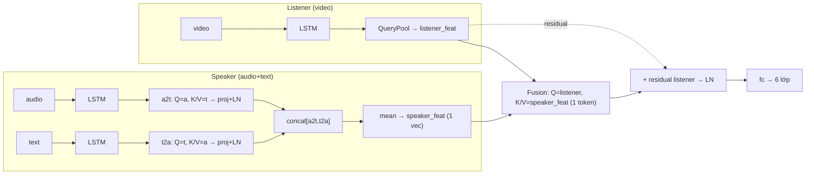

---

## v3 — WINNER ✅ (65.78)

**Nội dung = v1 + 2 sửa lỗi có chủ đích.**
- **Fix 2:** pool a2t và t2a **RIÊNG** → `sp_a = mean(a2t)`, `sp_t = mean(t2a)`.
  Mỗi modality 1 vector, trọng số cân bằng bất kể Ta≠Tt.
- **Fix 3:** fusion K/V = **2 token** `[sp_a, sp_t]` → attention không suy biến,
  chọn được giữa audio vs text.

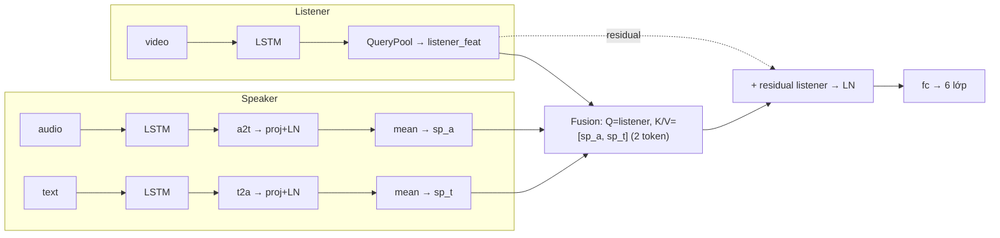

---

## Nhóm A — biến thể FUSION (v4, v5) · kết quả ~64 ✗

Giả thuyết: cho listener attend **chi tiết frame-level** qua toàn chuỗi a2t/t2a
(thay vì mean thành 1 vector) sẽ giàu thông tin hơn.

### v4 — attend full-sequence, trộn cố định 1:1
`attn_a = CrossAttn(Q=listener, K/V=a2t)`, `attn_t = CrossAttn(Q=listener, K/V=t2a)`,
rồi `0.5·attn_a + 0.5·attn_t + listener`.

### v5 — như v4 nhưng gate học được
`g = sigmoid(Linear([attn_a, attn_t]))`, `g·attn_a + (1−g)·attn_t + listener`.

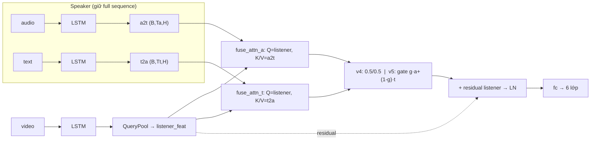
**Vì sao thất bại:** thêm chi tiết frame-level của **speaker** = thêm thông tin của
người sai vai → nhiễu, không giúp. Trần không phải ở độ mịn fusion.

---

## Nhóm B — VIDEO-ANCHOR (v2, v8) · kết quả 63 ✗

Giả thuyết: vì test chỉ tin được video, hãy đặt **video làm trục chính**, audio/text
chỉ bổ trợ.

### v2 — visual-anchored gated
Video **BiLSTM** → self-attention. Video làm query attend audio (`cross_va`) và text
(`cross_vt`). Gate trộn `g·v_a+(1−g)·v_t + h_v` (residual video thô sống sót khi a/t
không đáng tin). Pool → head. **Không** có nhánh speaker riêng.

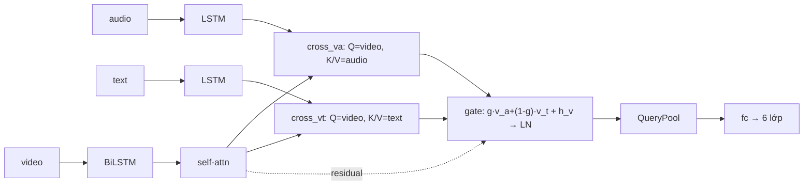

### v8 — Reliability-Guided (VISAFF-style)
Video anchor `h_v`. Truy hồi tham chiếu speaker bằng video làm query
(`a_ref`, `t_ref`). Δ = MLP([t_ref−h_v, a_ref−h_v]). Head phụ video-only cho độ tin
cậy `c_v` (detached). `h_v* = h_v + (1−c_v)·Δ` — **video tự tin thì nén speaker,
không chắc thì cho speaker bổ trợ**. Head trên `[h_v*, t_ref, a_ref]`.

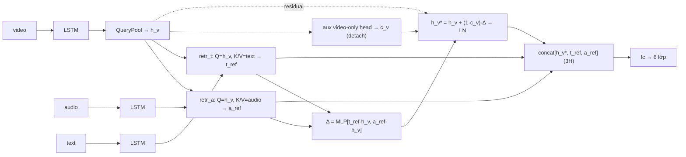
**Vì sao thất bại:** ép video làm trục chính bằng kiến trúc lại **bỏ mất contagion
+7 WAF** của audio/text; v2 đổi encoder (BiLSTM) làm lệch thêm.

---

## Nhóm C — AUX-LOSS (v6, v7, v11) · eval == v3, train thêm loss

Backbone **giống hệt v3 lúc inference**; chỉ thêm loss lúc train qua `interloss`.

### v6 — CM-StEW (65.36 ~)
Head phụ dịch `listener_feat → sp_a.detach / sp_t.detach` (L1) + align cosine
`listener_feat ↔ mean(sp_a,sp_t).detach`. Dạy video encoder mang thông tin dự báo
được giọng/lời **của cùng người** (hợp lệ ở train Individual).

### v7 — Nonverbal Conflict Exposure (62–63 ✗)
Với xác suất `conflict_p`, **tráo audio+text** của một mẫu bằng của mẫu **khác nhãn**
trong batch, giữ video + nhãn → dạy model neo vào video, không bị speaker sai vai đánh lừa.

### v11 — deep-supervision video (~65 ~)
Head phụ CE **chỉ trên `listener_feat`** → ép nhánh video tự phân biệt cảm xúc, chống
"video lười" (in-domain audio/text mạnh nên fusion đạt loss thấp mà không cần video tốt).

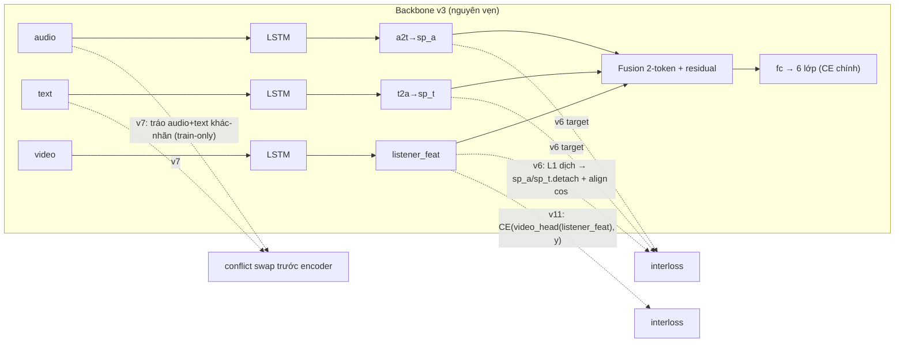
**Vì sao gần trung tính/hại:** train-signal cho nhánh video **không** phá được trần —
thông tin bị chặn không nằm ở cách huấn luyện video.

---

## Nhóm D — FEATURE AU (v9, v10) · 60–61 ✗

Giả thuyết: thêm Action Units (FACS) — biểu cảm identity-invariant — giúp video.
Dùng feature gộp `clip_au-FRA` (CLIP + AU), tách trong model.

### v9 — 2 nhánh video, fusion ở embedding
CLIP branch + AU branch riêng → mỗi cái QueryPool → concat→proj (hoặc gate) →
`listener_feat`. Rồi speaker + fusion như v3.

### v10 — AU là token fusion thứ 3 (không phá anchor CLIP)
CLIP anchor giữ **y hệt v3**; `au_feat` chỉ thêm làm token K/V thứ 3:
`kv = [sp_a, sp_t, au_feat]` → attention dùng hoặc bỏ, không kéo tụt CLIP.

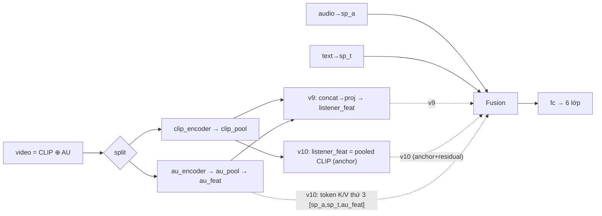
**Vì sao thất bại (AU observation-shift):** train = người **nói** → mouth-AU mã hoá
**cấu âm**; test = người **im lặng** → cùng AU mã hoá **cảm xúc**. py-feat AU trên
crop OpenFace vì thế lệch phân phối train↔test → hại −5 WAF (cả bản zero mouth-AU).

---

## Nhóm E — TRANSDUCTIVE (pseudo-label, TMA)

Không đổi kiến trúc; dùng 20k candidate (không nhãn, phân phối listener) làm dữ liệu.

### Pseudo-label trộn (66.0, +0.2 ~)
v3 gán nhãn giả candidate → **trộn vào** train thật → retrain toàn bộ v3.
Marginal: mặt-đang-nói (train thật) vẫn lấn át.

### TMA / BBA — Bridge then Begin Anew (61.47, −4.3 ✗)
Bridge = v3 (sinh nhãn giả + cho mượn trọng số). **Re-init** {listener_pool, fusion,
fc_out}, **freeze** {audio/text/video encoder, speaker cross-attn}, train **thuần**
trên candidate pseudo.

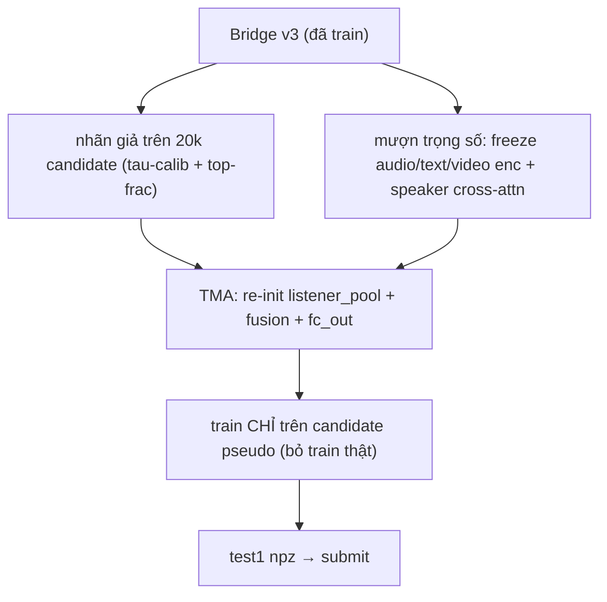
**Vì sao thất bại (confirmation-bias trap):** distill từ nhãn giả **cứng** (mất soft
info) = làm nghèo thầy; đồng thời **vứt train thật** — hoá ra train thật vẫn hữu ích.
→ Dừng nhánh, **không** làm Tier-2 (clustering refine) vì xây trên đúng nền vừa sập.

---

## Các trục KHÔNG-kiến-trúc

| Thử | Nội dung | Kết quả |
|---|---|---|
| **AU/landmark/pose feature** | py-feat trên crop OpenFace | −5 ✗ (observation-shift) |
| **class-weight** | inverse-freq trong CE | giữ, + |
| **label-shift τ** | `logit − τ·log(train_prior)`, τ=2.5 hậu kỳ | giữ, + |
| **label-smoothing** | thay class-weight | ~ |
| **MLLM zero-shot** | gemini/gpt-4o + prompt vai + FACS cue | WAF ~0.42, cần fine-tune ✗ |

---

## Nhóm F — Fusion bất đối xứng (v12) · VIB-FiLM

**Chỉ đổi fusion** (encoders + speaker branch + listener pool = v3). Video =
anchor; speaker audio/text nén qua **VIB** → sinh **FiLM (γ,β)** điều chế anchor.
FiLM zero-init → khởi động pure-video-anchor. VIB KL = interloss train-only.

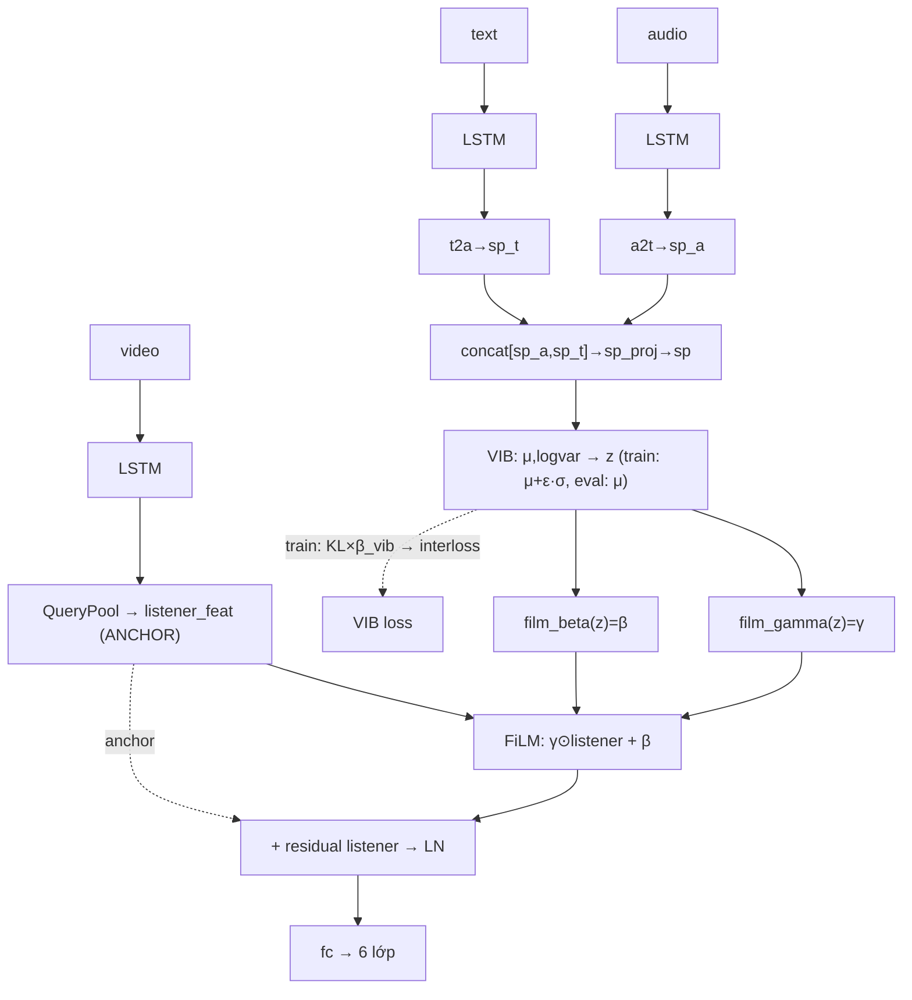

---

## Nhóm G — MLLM (Qwen2.5-VL-7B, QLoRA) · 42–50 ✗

Bỏ hẳn feature-fusion. Đưa **frame mặt thô** + transcript vào VLM, fine-tune LoRA
sinh nhãn; infer bằng verbalizer scoring (log-prob 6 nhãn). Thất bại vì **vision
generic + freeze + mặt 112² thấp** đọc micro-expression yếu (video-only 42.8).

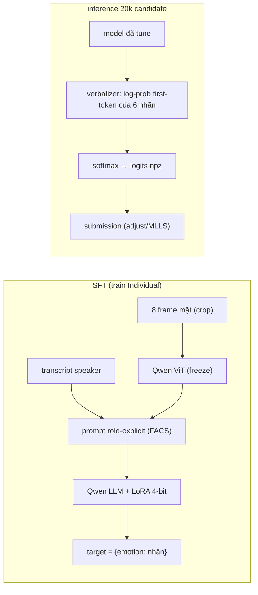
*(Biến thể video-only = bỏ nhánh transcript → 42.8; có transcript → 49.84.)*

---

## Nhóm H — FER backbone (thay CLIP) · 59.6–61 ✗

Thay feature video CLIP bằng embedding từ model **chuyên FER** (HSEmotion,
AffectNet-8). Kiến trúc v3 giữ nguyên phần audio/text/fusion. Thất bại vì FER
train trên **mặt posed/biểu cảm mạnh** ≠ mặt listener hội thoại tinh tế.

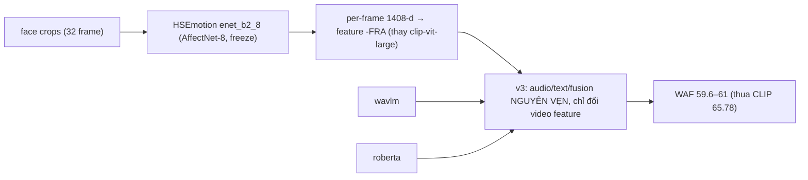

---

## Kết luận xuyên suốt

Ba trục của nhánh video — **capacity** (v2), **information** (v9/v10),
**training-signal** (v6/v11) — đều âm hoặc trung tính. Kết hợp fusion-variant (v4/v5),
video-anchor (v2/v8), conflict (v7), transductive (pseudo/TMA) đều không phá được
**trần thông tin ~66**. Điều này chỉ ra bottleneck **không** nằm trong không gian
feature-fusion hiện tại → muốn lên 70 phải đổi *nguồn thông tin* (MLLM fine-tune) hoặc
*biểu diễn video* (backbone chuyên FER) — xem `PROBLEM_FRAMING.md` mục 5.
